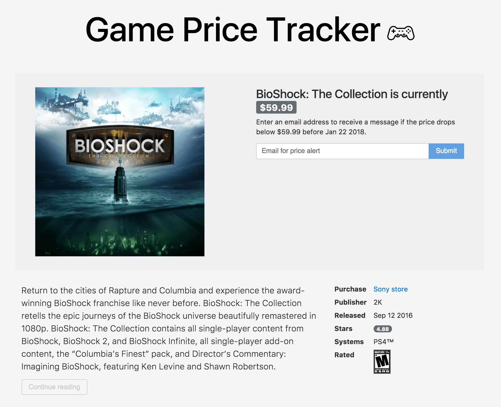

# Game Price Tracker 

*The PlayStation store has weekly sales with some surprisingly deep discounts on their games. The problem: I don't care enough to check their sales regularly. The solution: some fancy pants automation!*  

### A working build can be viewed [here](https://game-price-tracker.herokuapp.com/) for demonstration purposes.  
Note that it takes a moment for Heroku's services to initially activate.

---

### Detailed description
The app allows a user to search for a PlayStation game, and to submit their email address to sign up for a notification if the game goes on sale. The game and user info are stored in a MongoDB collection as a 'price alert.'

Once a day, the app's back-end iterates through the database and queries the PlayStation store, comparing prices to determine if the game is on sale. If the game is on sale, the user will receive an email. If the game hasn't gone on sale for 18 weeks, the user's price alert is deleted, and the user is invited to sign up again.

#### Preview screenshot

**Credit:** [Video game controller svg icon](https://www.flaticon.com/free-icon/gamepad_263076#term=gamepad&page=1&position=3) made by <a href="http://www.freepik.com" title="Freepik">Freepik</a> from <a href="http://www.flaticon.com" title="Flaticon">www.flaticon.com</a> is licensed by <a href="http://creativecommons.org/licenses/by/3.0/" title="Creative Commons BY 3.0" target="_blank">CC 3.0 BY</a> // 
