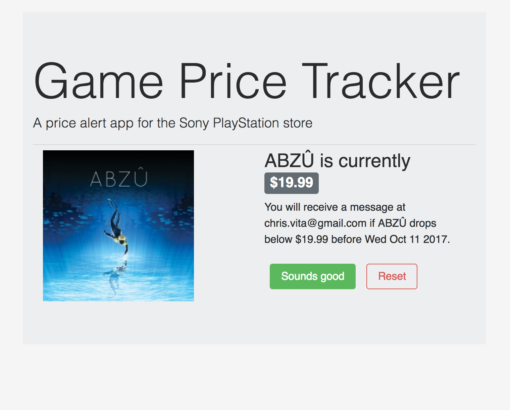

# Game Price Tracker

*The PlayStation store has weekly sales with some surprisingly deep discounts on their games. The problem: I don't care enough to check their sales regularly. The solution: some fancy-pants automation!*  

This project is currently under development, but can be viewed locally.  
* Clone the repo
* ````cd game-price-tracker````
* ````npm i```` to install dependencies
* ````npm start```` to start the node and react servers (This command is only compatible with Unix and MacOS, see ````package.json````)
* Visit ````localhost:3000```` to check things out

---

### Detailed description
The app allows a user to paste in a valid Sony PlayStation store game URL and enter their email address. Upon confirmation, the game and user info are stored in a MongoDB collection. Then, once a day, the app's back-end will iterate through the database and scrape* the PlayStation store, comparing prices to determine if the game is on sale. If the game is on sale, the user will receive an email alert. If the game hasn't gone on sale for 18 weeks, the user's document in Mongo is deleted, and the user is invited to sign up again.

*The PlayStation store doesn't have a public API, and loads quite slowly. So far, scraping Sony's site with the help of [HorsemanJS](https://github.com/johntitus/node-horseman) is working quite well!

### Preview screenshot
