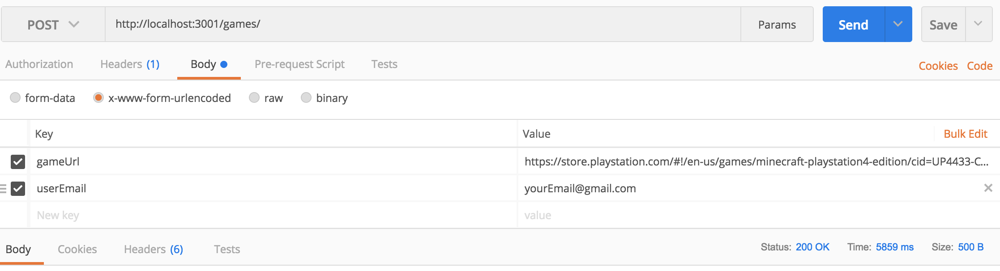

# Game Price Tracker

----
## A price alert api for the Sony PlayStation store
*Consider the current build as a prototype. There's lots more to do. These notes below are mostly for myself, but feel free to check it out.*

You can use Postman to play around with the current build
---
1. Clone this repo
2. Install dependencies via npm
3. Start 'er up! ```npm run server```
4. Open [Postman](https://www.getpostman.com/)
5. Create a POST request to ````http://localhost:3001/games/```` with two key-value pairs: ```gameURL``` and ```userEmail```. Note the gameURL must come from the Sony PlayStation store. See example image below.

[]

That's it!


**Then what happens?**
tl;dr It's an automated price alert.

As long as your server is running, the program will check the current price of your submitted game once a day at 9:15am. If the new price is below the original price, it'll send you an email.